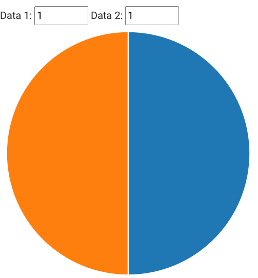

# Entry 4
##### 3/17/2024

I am currently on step 5 of the Engineering Design Process (EDP) which is to create a prototype of my project. I am working on making my bare bones project. 

Throughout this time, I have learned some valuable skills that can be helpful in and outside of SEP. These skills are used to help you learn deeply and more efficiently. One of these skills is having attention to detail. The syntax in JS isn't exactly hard, but if there is something wrong with your syntax then your whole code may not work. A way around this is to plan your work before you do it and work slower. Working fast can lead to careless mistakes that you wouldn't normally make. Another skill I have developed during this time is my consideration of the impact of my project. My project is meant for people to learn about themselves as baseball players through their statistics. Players will input data such as the number of innings pitched and how many runs they allowed. Then the code will output more complex data about their stats. I found the formulas for my project using [Calculating Baseball Stats](https://www.mlbbaseballfreepicks.com/calculating-baseball-stats/) and they had every formula I needed to make my project

The past few weeks I have started working towards the MVP which is the base of my project where everything works but there is still room for improvement. I started by testing code in jsbin of how I was goining to allow a user to input data. I started with prompts but I will probably change that into text boxes so that the users aren't limited to one question at a time. 

``` js
var innings = prompt('How many innings did you pitch?')
// console.log(innings);

var runs= prompt('How many runs did you allow?')
// console.log(runs);

var ERA = (runs / innings) * 9;

console.log(ERA);
```
This code takes in two numbers and outputs one number. On average, an MLB pitcher has 34 starts. Lets say they pitch 6 innings each start which is 204 total innings pitched. He gives up 2 runs per start which is 68 total runs. We take (68runs / 204innings) * 9 and his ERA (Earned Run Average) is 3.

After coding this I realized that when the numbers weren't perfectly divisible by eachother it would output an extreamly long decimal. I had to figure out how to have only two decimal places. I did some searching and I found a source that could help me figure out how to round. [stack overflow](https://stackoverflow.com/questions/51357334/how-would-i-round-a-number-eg-2-12-to-the-nearest-tenth-2-1-in-js) I used `Math.round`, multiplication, and division to round the number to two decimal places. 

``` js
var innings = prompt('How many innings did you pitch?')
// console.log(innings);

var runs= prompt('How many runs did you allow?')
// console.log(runs);

var ERA = (runs / innings) * 9;

console.log(Math.round(ERA * 100) / 100);
```
The variable "ERA" is multiplied by 100 to shift the decimal two places to the right. Then `Math.round` is used to round that number to the nearest whole number. Lastly the number is divided by 100, moving the 1's and 10's place back into decimals.

I also created a pie chart using D3.js so the user could input data to visualize their statistics. 
(FreedomProjectPic.png)


For example if a pitcher were to use this, they would want to input how many strikes they threw for one data point, and how many balls they threw for the other data point. This way the user could see the ratio of strikes to balls.

My next steps for the EDP is to continue working on the formulas, and to move on to step 6 which is to test the prototype. I am going to test MLB player statistics to see if all of my formulas work correctly and are rounded to the right decimal place depending on which statistic I am testing.
[Previous](entry03.md) | [Next](entry05.md)

[Home](../README.md)
